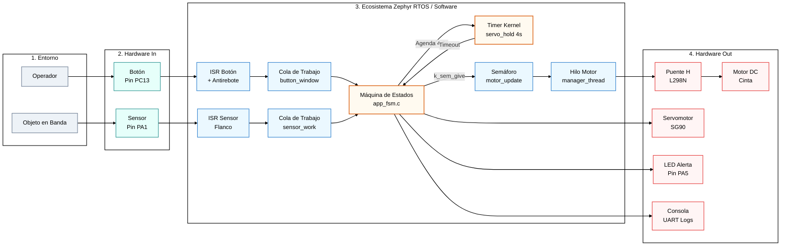

```mermaid
graph LR
    %% Paleta Industrial con Texto Negro de Alto Contraste
    classDef entorno fill:#edf2f7,stroke:#718096,stroke-width:1.5px,color:#000000;
    classDef hw_in fill:#e6fffa,stroke:#319795,stroke-width:1.5px,color:#000000;
    classDef kernel fill:#ebf8ff,stroke:#3182ce,stroke-width:1.5px,color:#000000;
    classDef fsm fill:#fffaf0,stroke:#dd6b20,stroke-width:2px,color:#000000;
    classDef hw_out fill:#fff5f5,stroke:#e53e3e,stroke-width:1.5px,color:#000000;

    %% Estilo global para todas las flechas (en negro)
    linkStyle default stroke:#000000,stroke-width:1.5px,fill:none;

    %% 1. ENTRADAS Y ESTÍMULOS
    subgraph S1 [1. Entorno]
        A[Operador]:::entorno
        B[Objeto en Banda]:::entorno
    end

    %% 2. PERIFÉRICOS DE ENTRADA
    subgraph S2 [2. Hardware In]
        C[Botón <br> Pin PC13]:::hw_in
        D[Sensor <br> Pin PA1]:::hw_in
    end

    %% 3. KERNEL Y PROCESAMIENTO
    subgraph S3 [3. Ecosistema Zephyr RTOS / Software]
        E[ISR Botón <br> + Antirebote]:::kernel
        F[ISR Sensor <br> Flanco]:::kernel
        
        G[Cola de Trabajo <br> button_window]:::kernel
        H[Cola de Trabajo <br> sensor_work]:::kernel
        
        I[Máquina de Estados <br> app_fsm.c]:::fsm
        
        L[Timer Kernel <br> servo_hold 4s]:::fsm
        J[Semáforo <br> motor_update]:::kernel
        K[Hilo Motor <br> manager_thread]:::kernel
    end

    %% 4. ACTUADORES Y SALIDAS
    subgraph S4 [4. Hardware Out]
        M[Puente H <br> L298N]:::hw_out
        N[Motor DC <br> Cinta]:::hw_out
        O[Servomotor <br> SG90]:::hw_out
        P[LED Alerta <br> Pin PA5]:::hw_out
        Q[Consola <br> UART Logs]:::hw_out
    end

    %% Estilo para los contenedores (Subgraphs): Fondo blanco, bordes negros y texto negro
    style S1 fill:#ffffff,stroke:#000000,stroke-width:1.5px,color:#000000;
    style S2 fill:#ffffff,stroke:#000000,stroke-width:1.5px,color:#000000;
    style S3 fill:#ffffff,stroke:#000000,stroke-width:1.5px,color:#000000;
    style S4 fill:#ffffff,stroke:#000000,stroke-width:1.5px,color:#000000;

    %% FLUJO PRINCIPAL DE IZQUIERDA A DERECHA
    A --> C
    B --> D
    
    C --> E
    D --> F
    
    E --> G
    F --> H
    
    G --> I
    H --> I
    
    %% Lógica interna de la FSM
    I -->|Agenda 4.0s| L
    L -->|Timeout| I
    I -->|k_sem_give| J
    J --> K
    
    %% Conexiones directas a periféricos de salida
    K --> M
    M --> N
    I --> O
    I --> P
    I --> Q
```