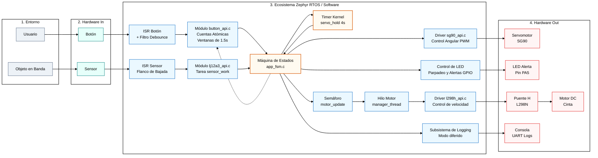

```mermaid
graph LR
    %% Paleta Industrial con Texto Negro de Alto Contraste
    classDef entorno fill:#edf2f7,stroke:#718096,stroke-width:1.5px,color:#000000;
    classDef hw_in fill:#e6fffa,stroke:#319795,stroke-width:1.5px,color:#000000;
    classDef kernel fill:#ebf8ff,stroke:#3182ce,stroke-width:1.5px,color:#000000;
    classDef fsm fill:#fffaf0,stroke:#dd6b20,stroke-width:2px,color:#000000;
    classDef hw_out fill:#fff5f5,stroke:#e53e3e,stroke-width:1.5px,color:#000000;

    %% Estilo global para todas las flechas (en negro)
    linkStyle default stroke:#000000,stroke-width:1.5px,fill:none;

    %% 1. ENTRADAS Y ESTÍMULOS
    subgraph S1 [1. Entorno]
        A[Usuario]:::entorno
        B[Objeto en Banda]:::entorno
    end

    %% 2. PERIFÉRICOS DE ENTRADA
    subgraph S2 [2. Hardware In]
        C[Botón]:::hw_in
        D[Sensor]:::hw_in
    end

    %% 3. KERNEL Y PROCESAMIENTO
    subgraph S3 [3. Ecosistema Zephyr RTOS / Software]
        E[ISR Botón <br> + Filtro Debounce]:::kernel
        F[ISR Sensor <br> Flanco de Bajada]:::kernel
        
        G["Módulo button_api.c <br> Cuentas Atómicas <br> Ventanas de 1.5s"]:::kernel
        H["Módulo lj12a3_api.c <br> Tarea sensor_work"]:::kernel
        
        I[Máquina de Estados <br> app_fsm.c]:::fsm
        L[Timer Kernel <br> servo_hold 4s]:::fsm
        
        S[Driver sg90_api.c <br> Control Angular PWM]:::kernel
        T[Control de LED <br> Parpadeo y Alertas GPIO]:::kernel
        U[Subsistema de Logging <br> Modo diferido]:::kernel
        
        J[Semáforo <br> motor_update]:::kernel
        K[Hilo Motor <br> manager_thread]:::kernel
        R["Driver l298h_api.c <br> Control de velocidad"]:::kernel
    end

    %% 4. ACTUADORES Y SALIDAS
    subgraph S4 [4. Hardware Out]
        O[Servomotor <br> SG90]:::hw_out
        P[LED Alerta <br> Pin PA5]:::hw_out
        M[Puente H <br> L298N]:::hw_out
        N[Motor DC <br> Cinta]:::hw_out
        Q[Consola <br> UART Logs]:::hw_out
    end

    %% Estilo para los contenedores (Subgraphs)
    style S1 fill:#ffffff,stroke:#000000,stroke-width:1.5px,color:#000000;
    style S2 fill:#ffffff,stroke:#000000,stroke-width:1.5px,color:#000000;
    style S3 fill:#ffffff,stroke:#000000,stroke-width:1.5px,color:#000000;
    style S4 fill:#ffffff,stroke:#000000,stroke-width:1.5px,color:#000000;

    %% CARRIL 1: Procesamiento de Usuario (Botón)
    A --> C
    C --> E
    E --> G
    G --> I
    I -.-> G

    %% CARRIL 2: Procesamiento de Planta (Sensor)
    B --> D
    D --> F
    F --> H
    H --> I
    I --> L
    L --> I

    %% CARRIL 3: Subsistema del Servomotor
    I --> S
    S --> O

    %% CARRIL 4: Subsistema del LED Indicador
    I --> T
    T --> P

    %% CARRIL 5: Subsistema de Potencia (Motor)
    I --> J
    J --> K
    K --> R
    R --> M
    M --> N
    
    %% CARRIL 6: Subsistema de Diagnóstico (Logging)
    I --> U
    U --> Q
```