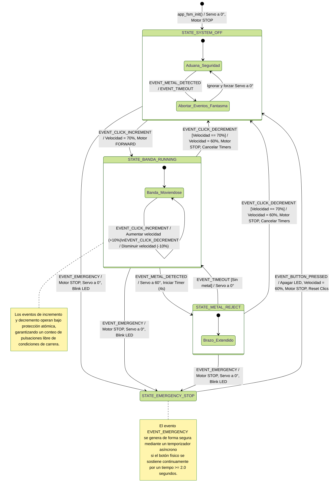

```mermaid
%%{init: { 'theme': 'forest', 'themeVariables': { 'lineColor': '#000000', 'arrowheadColor': '#000000', 'transitionColor': '#000000', 'transitionLabelColor': '#000000' } } }%%
stateDiagram-v2
    [*] --> STATE_SYSTEM_OFF : app_fsm_init() / Servo a 0°, Motor STOP

    state STATE_SYSTEM_OFF {
        [*] --> Aduana_Seguridad
        Aduana_Seguridad --> Abortar_Eventos_Fantasma : EVENT_METAL_DETECTED / EVENT_TIMEOUT
        Abortar_Eventos_Fantasma --> Aduana_Seguridad : Ignorar y forzar Servo a 0°
    }

    STATE_SYSTEM_OFF --> STATE_BANDA_RUNNING : EVENT_CLICK_INCREMENT / Velocidad = 70%, Motor FORWARD
    
    state STATE_BANDA_RUNNING {
        [*] --> Banda_Moviendose
        Banda_Moviendose --> Banda_Moviendose : EVENT_CLICK_INCREMENT / Aumentar velocidad (+10%)\nEVENT_CLICK_DECREMENT / Disminuir velocidad (-10%)
    }

    STATE_BANDA_RUNNING --> STATE_METAL_REJECT : EVENT_METAL_DETECTED / Servo a 60°, Iniciar Timer (4s)
    STATE_BANDA_RUNNING --> STATE_SYSTEM_OFF : EVENT_CLICK_DECREMENT [Velocidad == 70%] / Velocidad = 60%, Motor STOP, Cancelar Timers

    state STATE_METAL_REJECT {
        [*] --> Brazo_Extendido
    }

    STATE_METAL_REJECT --> STATE_BANDA_RUNNING : EVENT_TIMEOUT [Sin metal] / Servo a 0°
    STATE_METAL_REJECT --> STATE_SYSTEM_OFF : EVENT_CLICK_DECREMENT [Velocidad == 70%] / Velocidad = 60%, Motor STOP, Cancelar Timers

    %% Transiciones de Emergencia Globales
    STATE_SYSTEM_OFF --> STATE_EMERGENCY_STOP : EVENT_EMERGENCY / Motor STOP, Servo a 0°, Blink LED
    STATE_BANDA_RUNNING --> STATE_EMERGENCY_STOP : EVENT_EMERGENCY / Motor STOP, Servo a 0°, Blink LED
    STATE_METAL_REJECT --> STATE_EMERGENCY_STOP : EVENT_EMERGENCY / Motor STOP, Servo a 0°, Blink LED

    %% Desbloqueo seguro coordinado con la implementación en C
    STATE_EMERGENCY_STOP --> STATE_SYSTEM_OFF : EVENT_BUTTON_PRESSED / Apagar LED, Velocidad = 60%, Motor STOP, Reset Clics

    %% NOTAS PARA EL DIAGRAMA
    note right of STATE_EMERGENCY_STOP
        El evento EVENT_EMERGENCY 
        se genera de forma segura mediante un temporizador asíncrono
        si el botón físico se sostiene continuamente por un tiempo >= 2.0 segundos.
    end note
    note right of STATE_BANDA_RUNNING
        Los eventos de incremento y decremento operan bajo protección atómica,
        garantizando un conteo de pulsaciones libre de condiciones de carrera.
    end note
```